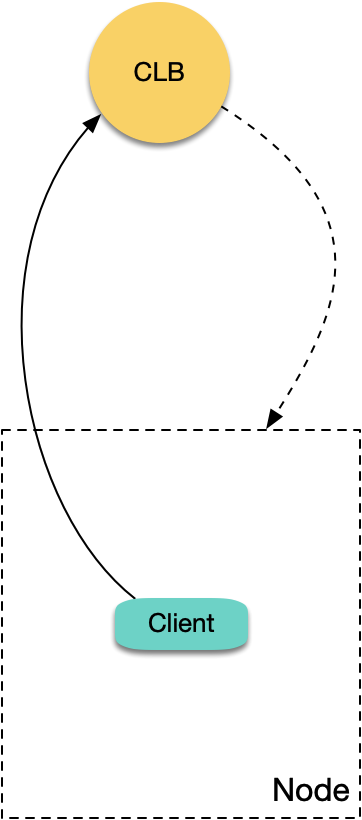
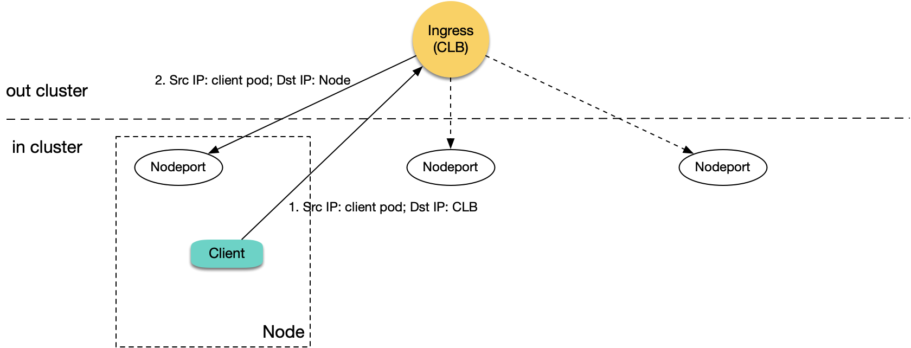
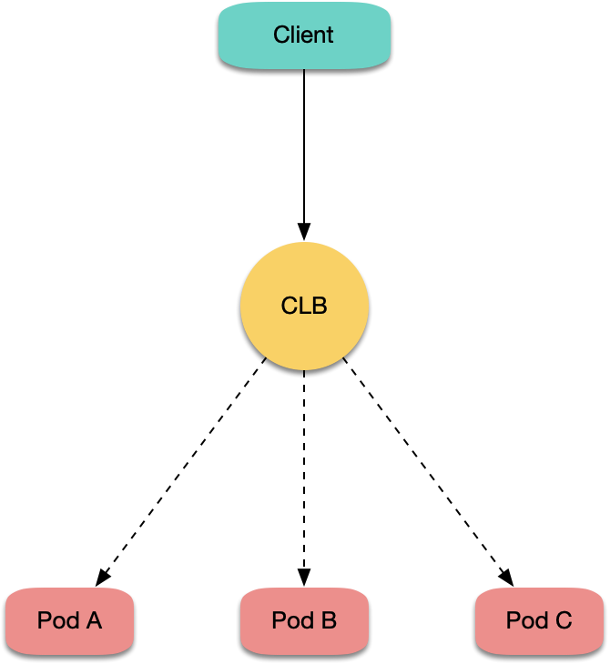

## 问题描述

使用 TKE 一些用户，可能会遇到因 CLB 回环问题导致服务访问不通或访问 Ingress 几秒延时的现象，本文就此问题介绍下相关背景、原因以及一些思考与建议。

## 有哪些现象？

CLB 回环可能导致的问题现象有：

1. 不管是 iptables 还是 ipvs 模式，访问本集群内网 Ingress 出现 4 秒延时或不通。
1. ipvs 模式下，集群内访问本集群 LoadBanacer 类型的内网 Service 出现完全不通，或者时通时不通。

## 为什么会回环？

根本原因在于 CLB 将请求转发到 rs 时，报文的源目的 IP 都在同一节点内，导致数据包在子机内部回环出不去：

下面我们针对具体场景来分析下。

### 分析 Ingress 回环

我们先来分析下 Ingress。使用 TKE 默认自带的 Ingress，会为每个 Ingress 资源创建一个 CLB 以及 80，443 的 7 层监听器规则(HTTP/HTTPS)，并为 Ingress 每个 location 绑定对应 TKE 各个节点某个相同的 NodePort 作为 rs (每个 location 对应一个 Service，每个 Service 都通过各个节点的某个相同 NodePort 暴露流量)，CLB 根据请求匹配 location 转发到相应的 rs (即 NodePort)，流量到了 NodePort 后会再经过 K8S 的 iptables 或 ipvs 转发给对应的后端 Pod。集群中的 Pod 访问本集群的内网 Ingress，CLB 将请求转发给其中一台节点的对应 NodePort：



如图，当被转发的这台节点恰好也是发请求的 client 所在节点时：

1. 集群中的 Pod 访问 CLB，然后 CLB 将请求转发到任意一台节点的对应 NodePort。
1. 报文到 NodePort 时，目的 IP 是节点 IP，源 IP 是 client  pod 的真实 IP， 因为 CLB 不做 SNAT，会将真实源 IP 透传过去。
1. 由于源 IP 与目的 IP 都在这台机器内，所以就导致了回环，CLB 将收不到来自 rs 的响应。


那为什么访问集群内 Ingress 的故障现象大多是几秒延时呢？因为 7 层 CLB 如果请求 rs 后端超时(大概 4s)，会重试下一个 rs，所以如果 client 这侧设置的超时时间较长，出现回环问题的现象就是请求响应慢，有几秒的延时。当然如果集群只有一个节点，CLB 也没得可以重试的 rs，现象就是访问不通了。

### 分析 LoadBalancer Service 回环

上面分析了 7 层 CLB 的情况，下面来分析下 4 层 CLB。当使用 LoadBalancer 类型的内网 Service 时暴露服务时，会创建内网 CLB 并创建对应的 4 层监听器(TCP/UDP)。当集群内 Pod 访问 LoadBalancer 类型 Service 的  `EXTERNAL-IP` 时(即 CLB IP)，原生 K8S 实际上不会去真正访问 LB，而是直接通过 iptables 或 ipvs 转发到后端 Pod (不经过 CLB)：


所以原生 K8S 的逻辑是不会有这个问题的。但在 TKE 的 ipvs 模式下，client 访问 CLB IP 的包会真正到 CLB，所以如果在 ipvs 模式下 Pod 访问本集群 LoadBalancer 类型 Service 的 CLB IP 会遇到回环问题，情况跟前面内网 Ingress 回环类似：


有一点不同的是，四层 CLB 不会重试下一个 rs，当遇到回环时，现象通常是时通时不通；当然如果集群只有一个节点，也就完全不通。

那为什么 TKE 的 ipvs 模式不是用原生 K8S 那样的转发逻辑呢(不经过 LB，直接转发到后端 pod)？这个要从我在 19 年 7 月份发现，到目前为止社区都还没解决的问题说起: https://github.com/kubernetes/kubernetes/issues/79783

这里大概介绍下背景，以前 TKE 的 ipvs 模式集群使用 LoadBalancer 内网 Service 暴露服务，内网 CLB 对后端 NodePort 的健康探测会全部失败，原因是:

1. ipvs 主要工作在 INPUT 链，需要将要转发的 VIP (Service 的 Cluster IP 和 `EXTERNAL-IP` )当成本机 IP，才好让报文进入 INPUT 链交给 ipvs 处理。
2. kube-proxy 的做法是将 Cluster IP 和 `EXTERNAL-IP` 都绑到一个叫 `kube-ipvs0` 的 dummy 网卡，这个网卡仅仅用来绑 VIP (内核自动为其生成 local 路由)，不用于接收流量。
3. 内网 CLB 对 NodePort 的探测报文源 IP 是 CLB 自身的 VIP，目的 IP 是 Node IP。当探测报文到达节点时，节点发现源 IP 是本机 IP (因为它被绑到了 `kube-ipvs0`)，就将其丢掉。所以 CLB 的探测报文永远无法收到响应，也就全部探测失败，虽然 CLB 有全死全活逻辑 (全部探测失败视为全部可以被转发)，但也相当于探测就没起到任何作用，在某些情况下会造成一些异常。

为了解决这个问题，TKE 的修复策略是：ipvs 模式不绑 `EXTERNAL-IP` 到 `kube-ipvs0` 。也就是说，集群内 Pod 访问 CLB IP 的报文不会进入 INPUT 链，而是直接出节点网卡，真正到达 CLB，这样健康探测的报文进入节点时就不会被当成本机 IP 而丢弃，同时探测响应报文也不会进入 INPUT 链导致出不去。

虽然这种方法修复了 CLB 健康探测失败的问题，但也导致集群内 Pod 访问 CLB 的包真正到了 CLB，由于访问集群内的服务，报文又会被转发回其中一台节点，也就存在了回环的可能性。

## 为什么公网 CLB 没这个问题？

使用公网 Ingress 和 LoadBalancer 类型公网 Service 没有回环问题，我的理解主要是公网 CLB 收到的报文源 IP 是子机的出口公网 IP，而子机内部感知不到自己的公网 IP，当报文转发回子机时，不认为公网源 IP 是本机 IP，也就不存在回环。

## CLB 是否有避免回环机制？

有。CLB 会判断源 IP，如果发现后端 rs 也有相同 IP，就不考虑转发给这个 rs，而选择其它 rs。但是，源 Pod IP 跟后端 rs IP 并不相同，CLB 也不知道这两个 IP 是在同一节点，所以还是可能会转发过去，也就可能发生回环。

## client 与 server 反亲和部署能否规避？

如果我将 client 跟 server 通过反亲和性部署，避免 client 跟 server 部署在同一节点，能否规避这个问题？默认情况下， LB 通过节点 NodePort 绑定 rs，可能转发给任意节点 NodePort，此时不管 client 与 server 是否在同一节点都可能发生回环。但如果给 Service 设置 `externalTrafficPolicy: Local`， LB 就只会转发到有 server pod 的节点，如果 client 与 server 通过反亲和调度在不同节点，此时是不会发生回环的，所以反亲和 + `externalTrafficPolicy: Local` 可以规避此问题(包括内网 Ingress 和 LoadBalancer 类型内网 Service)，就是有点麻烦。

## VPC-CNI 的 LB 直通 Pod 是否也存在这个问题？

TKE 通常用的 Global Router 网络模式(网桥方案)，还有一种是 VPC-CNI (弹性网卡方案)。目前 LB 直通 Pod 只支持 VPC-CNI 的 Pod，即 LB 不绑 NodePort 作为 rs，而是直接绑定后端 Pod 作为 rs：



这样就绕过了 NodePort，不会像之前一样可能会转发给任意节点。但如果 client 与 server 在同一节点，也一样还是可能会发生回环，通过反亲和可以规避。

## 有什么建议？

反亲和 与 `externalTrafficPolicy: Local` 的规避方式不太优雅。一般来讲，访问集群内的服务避免访问本集群的 CLB，因为服务本身在集群内部，从 CLB 绕一圈不仅会增加网络链路的长度，还会引发回环问题。

访问集群内服务尽量用 Service 名称，比如：`server.prod.svc.cluster.local` ，这样就不会经过 CLB，没有回环问题。

如果业务有耦合域名，不能使用 Service 名称，可以使用 coredns 的 rewrite 插件，将域名指向集群内的 Service，coredns 配置示例:

```yaml
apiVersion: v1
kind: ConfigMap
metadata:
  name: coredns
  namespace: kube-system
data:
  Corefile: |2-
        .:53 {
            rewrite name roc.oa.com server.prod.svc.cluster.local
        ...
            
```
如果多个 Service 共用一个域名，可以自行部署 Ingress Controller (如 nginx-ingress)，用上面 rewrite 的方法将域名指向自建的 Ingress Controller，然后自建的 Ingress 根据请求 location (域名+路径) 匹配 Service，再转发给后端 Pod，整段链路也是不经过 CLB，也能规避回环问题。

## 总结

本文对 TKE 的 CLB 回环问题进行了详细的梳理，介绍了其前因后果以及一些规避的建议。

