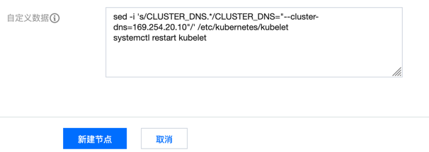

## 背景

TKE 对 NodeLocal DNS Cache 进行了产品化支持，直接在扩展组件里面就可以一键安装到集群，参考 [NodeLocalDNSCache 扩展组件说明](https://cloud.tencent.com/document/product/457/49423) ，可是仅仅支持 iptables 转发模式的集群，而目前大多集群都会使用 IPVS 转发模式，无法安装这个扩展组件。

本文将介绍如何在 TKE IPVS 模式集群中自行安装 NodeLocal DNS Cache。


## 准备 yaml

复制以下 yaml 到文件 `nodelocaldns.yaml`:

```yaml
# Copyright 2018 The Kubernetes Authors.
#
# Licensed under the Apache License, Version 2.0 (the "License");
# you may not use this file except in compliance with the License.
# You may obtain a copy of the License at
#
#     http://www.apache.org/licenses/LICENSE-2.0
#
# Unless required by applicable law or agreed to in writing, software
# distributed under the License is distributed on an "AS IS" BASIS,
# WITHOUT WARRANTIES OR CONDITIONS OF ANY KIND, either express or implied.
# See the License for the specific language governing permissions and
# limitations under the License.
#

apiVersion: v1
kind: ServiceAccount
metadata:
  name: node-local-dns
  namespace: kube-system
  labels:
    kubernetes.io/cluster-service: "true"
    addonmanager.kubernetes.io/mode: Reconcile
---
apiVersion: v1
kind: Service
metadata:
  name: kube-dns-upstream
  namespace: kube-system
  labels:
    k8s-app: kube-dns
    kubernetes.io/cluster-service: "true"
    addonmanager.kubernetes.io/mode: Reconcile
    kubernetes.io/name: "KubeDNSUpstream"
spec:
  ports:
  - name: dns
    port: 53
    protocol: UDP
    targetPort: 53
  - name: dns-tcp
    port: 53
    protocol: TCP
    targetPort: 53
  selector:
    k8s-app: kube-dns
---
apiVersion: v1
kind: ConfigMap
metadata:
  name: node-local-dns
  namespace: kube-system
  labels:
    addonmanager.kubernetes.io/mode: Reconcile
data:
  Corefile: |
    cluster.local:53 {
        errors
        cache {
                success 9984 30
                denial 9984 5
        }
        reload
        loop
        bind 169.254.20.10
        forward . __PILLAR__CLUSTER__DNS__ {
                force_tcp
        }
        prometheus :9253
        health 169.254.20.10:8080
        }
    in-addr.arpa:53 {
        errors
        cache 30
        reload
        loop
        bind 169.254.20.10
        forward . __PILLAR__CLUSTER__DNS__ {
                force_tcp
        }
        prometheus :9253
        }
    ip6.arpa:53 {
        errors
        cache 30
        reload
        loop
        bind 169.254.20.10
        forward . __PILLAR__CLUSTER__DNS__ {
                force_tcp
        }
        prometheus :9253
        }
    .:53 {
        errors
        cache 30
        reload
        loop
        bind 169.254.20.10
        forward . __PILLAR__UPSTREAM__SERVERS__
        prometheus :9253
        }
---
apiVersion: apps/v1
kind: DaemonSet
metadata:
  name: node-local-dns
  namespace: kube-system
  labels:
    k8s-app: node-local-dns
    kubernetes.io/cluster-service: "true"
    addonmanager.kubernetes.io/mode: Reconcile
spec:
  updateStrategy:
    rollingUpdate:
      maxUnavailable: 10%
  selector:
    matchLabels:
      k8s-app: node-local-dns
  template:
    metadata:
      labels:
        k8s-app: node-local-dns
      annotations:
        prometheus.io/port: "9253"
        prometheus.io/scrape: "true"
    spec:
      priorityClassName: system-node-critical
      serviceAccountName: node-local-dns
      hostNetwork: true
      dnsPolicy: Default  # Don't use cluster DNS.
      tolerations:
      - key: "CriticalAddonsOnly"
        operator: "Exists"
      - effect: "NoExecute"
        operator: "Exists"
      - effect: "NoSchedule"
        operator: "Exists"
      containers:
      - name: node-cache
        image: cr.imroc.cc/k8s/k8s-dns-node-cache:1.17.0
        resources:
          requests:
            cpu: 25m
            memory: 5Mi
        args: [ "-localip", "169.254.20.10", "-conf", "/etc/Corefile", "-upstreamsvc", "kube-dns-upstream" ]
        securityContext:
          privileged: true
        ports:
        - containerPort: 53
          name: dns
          protocol: UDP
        - containerPort: 53
          name: dns-tcp
          protocol: TCP
        - containerPort: 9253
          name: metrics
          protocol: TCP
        livenessProbe:
          httpGet:
            host: 169.254.20.10
            path: /health
            port: 8080
          initialDelaySeconds: 60
          timeoutSeconds: 5
        volumeMounts:
        - mountPath: /run/xtables.lock
          name: xtables-lock
          readOnly: false
        - name: config-volume
          mountPath: /etc/coredns
        - name: kube-dns-config
          mountPath: /etc/kube-dns
      volumes:
      - name: xtables-lock
        hostPath:
          path: /run/xtables.lock
          type: FileOrCreate
      - name: kube-dns-config
        configMap:
          name: kube-dns
          optional: true
      - name: config-volume
        configMap:
          name: node-local-dns
          items:
          - key: Corefile
            path: Corefile.base
---
# A headless service is a service with a service IP but instead of load-balancing it will return the IPs of our associated Pods.
# We use this to expose metrics to Prometheus.
apiVersion: v1
kind: Service
metadata:
  annotations:
    prometheus.io/port: "9253"
    prometheus.io/scrape: "true"
  labels:
    k8s-app: node-local-dns
  name: node-local-dns
  namespace: kube-system
spec:
  clusterIP: None
  ports:
  - name: metrics
    port: 9253
    targetPort: 9253
  selector:
    k8s-app: node-local-dns
```

## 替换集群 DNS 地址

获取集群 DNS 的地址并替换 yaml 文件中的 `__PILLAR__CLUSTER__DNS__` 变量:

```bash
kubedns=`kubectl get svc kube-dns -n kube-system -o jsonpath={.spec.clusterIP}`

sed -i "s/__PILLAR__CLUSTER__DNS__/$kubedns/g" nodelocaldns.yaml
```

> `__PILLAR__UPSTREAM__SERVERS__` 这个变量我们不管，localdns pod 会自行填充。


## 一键安装

通过以下命令一键安装到集群:

```bash
kubectl apply -f nodelocaldns.yaml
```

## 修改 kubelet 参数

IPVS 模式集群由于需要为所有 Service 在 `kube-ipvs0` 这个 dummy 网卡上绑对应的 Cluster IP，以实现 IPVS 转发，所以 localdns 就无法再监听集群 DNS 的 Cluster IP。而 kubelet 的 `--cluster-dns` 默认指向的是集群 DNS 的 Cluster IP 而不是 localdns 监听的地址，安装 localdns 之后集群中的 Pod 默认还是使用的集群 DNS 解析。

如何让 Pod 默认使用 localdns 进行 DNS 解析呢？需要改每个节点上 kubelet 的 `--cluster-dns` 启动参数:

```txt
--cluster-dns=169.254.20.10
```

如果让新增的节点都默认修改 kubelet 参数呢？可以在加节点时设置【自定义数据】(即自定义初始化脚本)，会在节点组件初始化好后执行:



脚本内容:

```bash
sed -i 's/CLUSTER_DNS.*/CLUSTER_DNS="--cluster-dns=169.254.20.10"/' /etc/kubernetes/kubelet
systemctl restart kubelet
```

每个节点都贴以下脚本过于麻烦，一般建议使用节点池，在节电池定义节点的【自定义数据】，这样就可以让节点池扩容出来的节点都会执行这个脚本，无需每个节点都单独设置。


更好的方案是使用产品化支持的 kubelet 参数自定义，在 TKE 已经支持，参考 [TKE 文档: 自定义 Kubernetes 组件启动参数](https://cloud.tencent.com/document/product/457/47775#.E8.AE.BE.E7.BD.AE.E8.8A.82.E7.82.B9.E7.9A.84.E8.87.AA.E5.AE.9A.E4.B9.89-kubelet-.E5.8F.82.E6.95.B0)

> **注:** 需要提交工单开白名单使用。
