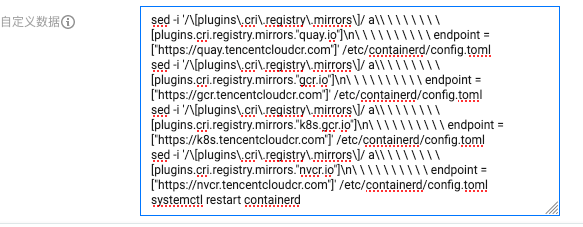

## 背景

在 TKE 上部署开源应用时，经常会遇到依赖的镜像拉不下来或非常慢的问题，比如 gcr, quay.io 等境外公开镜像仓库。实际 TKE 已经提供了海外镜像加速的能力，本文介绍如何使用此项能力来部署开源应用。

## 镜像地址映射

以下是支持的镜像仓库及其映射地址:

| 海外镜像仓库地址 | 腾讯云映射地址 |
|:----|:----|
| gcr.io | gcr.tencentcloudcr.com |
| k8s.gcr.io | k8s.tencentcloudcr.com |
| quay.io | quay.tencentcloudcr.com |
| nvcr.io | nvcr.tencentcloudcr.com |

## 修改镜像地址

在部署应用时，修改下镜像地址，将镜像仓库域名替换为腾讯云上的映射地址 (见上方表格)，比如将 `quay.io/prometheus/node-exporter:v0.18.1` 改为 `quay.tencentcloudcr.com/prometheus/node-exporter:v0.18.1`，这样拉取镜像时就会走到加速地址。

## 不想修改镜像地址 ?

如果镜像太多，嫌修改镜像地址太麻烦 (比如使用 helm 部署，用到了很多镜像)，可以利用 containerd 的 mirror 配置来实现无需修改镜像地址 (前提是容器运行时使用的 containerd )。 

> docker 仅支持 docker hub 的 mirror 配置，所以如果容器运行时是 docker 就必须修改镜像地址。

具体方法是修改 containerd 配置 (`/etc/containerd/config.toml`)，将腾讯云映射地址配到 mirrors 里:

```toml
    [plugins.cri.registry]
      [plugins.cri.registry.mirrors]
        [plugins.cri.registry.mirrors."quay.io"]
          endpoint = ["https://quay.tencentcloudcr.com"]
        [plugins.cri.registry.mirrors."k8s.gcr.io"]
          endpoint = ["https://k8s.tencentcloudcr.com"]
        [plugins.cri.registry.mirrors."gcr.io"]
          endpoint = ["https://gcr.tencentcloudcr.com"]
        [plugins.cri.registry.mirrors."nvcr.io"]
          endpoint = ["https://nvcr.tencentcloudcr.com"]
        [plugins.cri.registry.mirrors."docker.io"]
          endpoint = ["https://mirror.ccs.tencentyun.com"]
```

不过每个节点都去手动修改过于麻烦，我们可以在添加节点或创建节点池时指定下自定义数据 (即初始化节点时会运行的自定义脚本) 来自动修改 containerd 配置:



将下面的脚本粘贴进去:

```bash
sed -i '/\[plugins\.cri\.registry\.mirrors\]/ a\\ \ \ \ \ \ \ \ [plugins.cri.registry.mirrors."quay.io"]\n\ \ \ \ \ \ \ \ \ \ endpoint = ["https://quay.tencentcloudcr.com"]' /etc/containerd/config.toml
sed -i '/\[plugins\.cri\.registry\.mirrors\]/ a\\ \ \ \ \ \ \ \ [plugins.cri.registry.mirrors."gcr.io"]\n\ \ \ \ \ \ \ \ \ \ endpoint = ["https://gcr.tencentcloudcr.com"]' /etc/containerd/config.toml
sed -i '/\[plugins\.cri\.registry\.mirrors\]/ a\\ \ \ \ \ \ \ \ [plugins.cri.registry.mirrors."k8s.gcr.io"]\n\ \ \ \ \ \ \ \ \ \ endpoint = ["https://k8s.tencentcloudcr.com"]' /etc/containerd/config.toml
sed -i '/\[plugins\.cri\.registry\.mirrors\]/ a\\ \ \ \ \ \ \ \ [plugins.cri.registry.mirrors."nvcr.io"]\n\ \ \ \ \ \ \ \ \ \ endpoint = ["https://nvcr.tencentcloudcr.com"]' /etc/containerd/config.toml
systemctl restart containerd
```
 
> 推荐使用节点池，扩容节点时都会自动运行脚本，就不需要每次加节点都去配下自定义数据了。

## 参考资料

* [TKE 官方文档: 境外镜像拉取加速](https://cloud.tencent.com/document/product/457/51237)